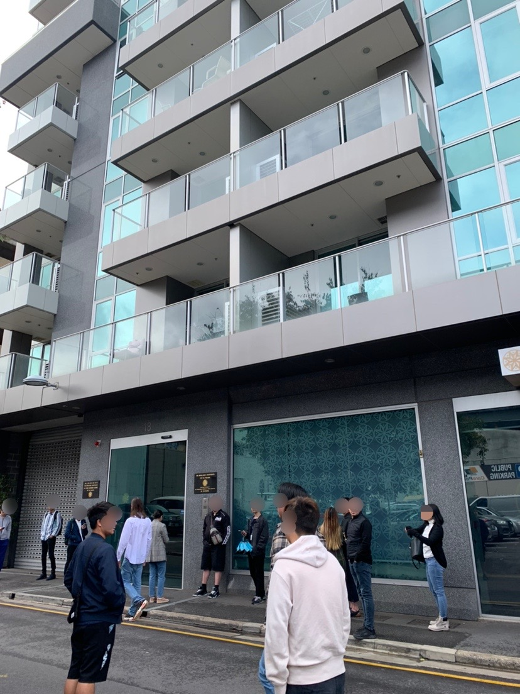
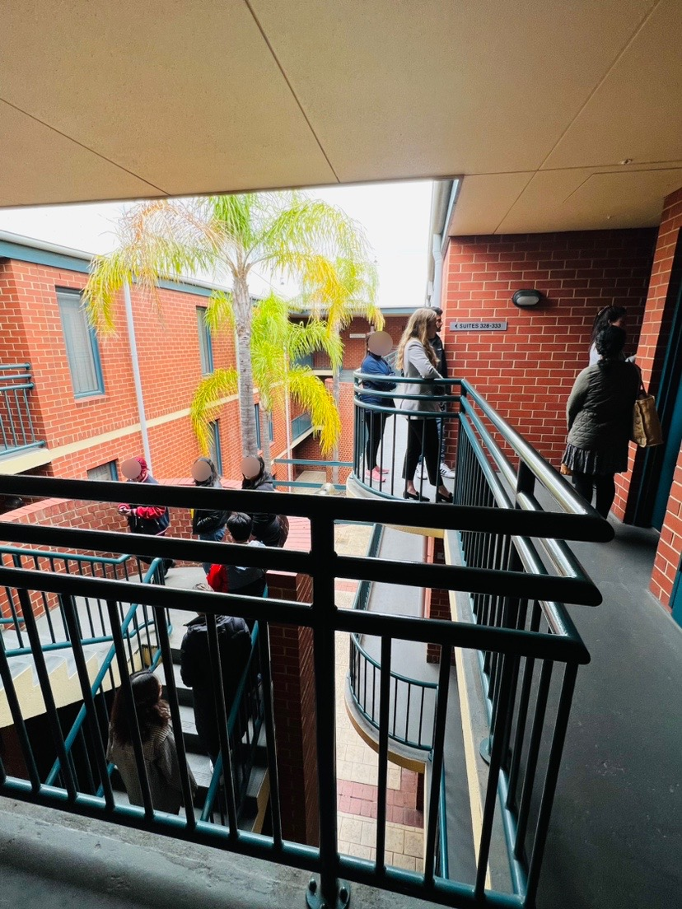

# ブログ

## 住まい
Airbnbに滞在した。当初は２週間滞在し、その間に、アパートを借りる予定だったが、見つからずさらに２週間滞在した。

### 住まい探し
Domainやrealestate.com.auというサイトに、空いている物件が日々更新されるので、毎日確認した。条件に合うものを見つけたら、不動産に連絡したり内見に行って申請した。40以上の物件を検討し、15の物件の内見に行き、オファーがもらえたのは2つだけだった。最初のオファーは値段が高すぎたので断り、二つ目のオファーでようやく契約に至った。これまで観た中でも一番条件がよかったのでよかった。

(2023.06.03.更新)

## 買い物
主流のスーパーマーケットはColesとWoolworthsというお店だ。毎週違う商品がセールになって、半額になっているものがある。

(2023.06.03.更新)
